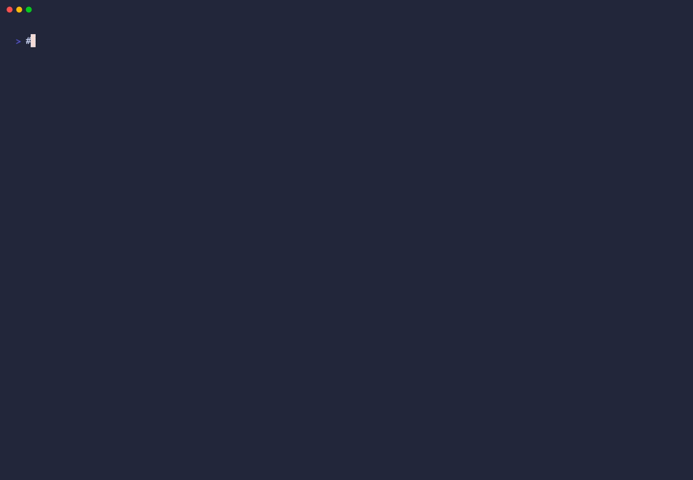

# a11y-eval

[](https://github.com/FrancoisChastel/a11y-eval/actions/workflows/ci.yml)
[](https://github.com/FrancoisChastel/a11y-eval/releases)
[](LICENSE)


WCAG 2.2 AA evaluation tool built entirely on open-source components. Point it at a **repo** and/or a **running app**: it detects the framework, statically scans the source, starts the dev server, **crawls** the pages, runs runtime accessibility engines on each, and merges everything into one scored, gateable report. Designed as the **evaluation function** for accessibility agents: deterministic input → structured JSON output.

## Demo

Evaluate a site — crawl, engines, verdict, remediation plan:



Then complete the manual half in the generated review UI — signal-suggested N/A with auto-evidence, per-criterion procedures, evidence capture, live progress:


## Quick start

```bash
pnpm install && npx playwright install chromium

# Repo mode — the "given a repo" workflow:
# detect framework → static a11y scan of source → start dev server → crawl → evaluate → merged report
node src/cli.ts --repo /path/to/your-app

# App already running? Skip the server start:
node src/cli.ts --repo /path/to/your-app --url http://localhost:3000 --crawl

# No source access — just a URL:
node src/cli.ts --url http://localhost:3000 --crawl
```

Outputs to `--out` (default `a11y-report/`): `report.json` (agent contract), `report.md` (human summary: at-a-glance, top fixes, findings, signals, gaps, next steps), `mitigations.md` (agent-executable fix work order), and `review.html` (human manual-review UI). Exit codes: `0` pass / pass-with-issues, `1` fail (critical or serious violations — CI gate), `2` error.

## What repo mode does

1. **Detect** — reads `package.json` + lockfiles: framework (Next/Angular/Svelte/Vue/CRA/Vite), package manager, dev script, default port.
2. **Static scan** — runs the repo's **own ESLint** when configured (its config knows the framework); otherwise falls back to a **bundled jsx-a11y** flat config for JSX/TSX. Findings carry `file:line:col` targets. Skip with `--no-static`, or merge an existing report instead with `--static-report <eslint.json>`.
3. **Start** — runs the detected dev script (or `--start-cmd`), polls until the app responds, and kills the whole process group afterward. Skipped when `--url` is provided.
4. **Crawl** — breadth-first same-origin link discovery from the base URL (same-directory scope for `file://`). Anchors, `mailto:`/`javascript:`, external origins, and asset links are skipped. Caps: `--max-pages` (15), `--max-depth` (3). On by default in repo mode (`--no-crawl` to disable).
5. **Evaluate every page** with the runtime engines, then merge runtime + static findings into one report.

## Engines

| Engine | Tool | Covers |
|--------|------|--------|
| `axe` | [axe-core](https://github.com/dequelabs/axe-core) (MPL-2.0) via `@axe-core/playwright` | WCAG 2.0/2.1/2.2 A+AA automated rules: contrast, names/roles/values, ARIA validity, document structure |
| `keyboard` | Custom [Playwright](https://github.com/microsoft/playwright) checks | Gaps axe can't see: **2.1.1** click-affordance elements not keyboard-operable, **2.4.7** no visible focus indicator, **1.4.10** horizontal overflow at 320px |
| `static` | [ESLint](https://eslint.org) + repo config or bundled [eslint-plugin-jsx-a11y](https://github.com/jsx-eslint/eslint-plugin-jsx-a11y) | Pre-render source issues, mapped to `file:line:col` |

## CLI reference

```
--url <url>            Seed page (http(s)://, file://, or local HTML path). Repeatable.
--repo <dir>           Source repo (enables repo mode).
--start-cmd <cmd>      Command to start the app (default: detected dev script).
--port <n>             App port (default: framework default).
--crawl / --no-crawl   Toggle page discovery (default: on in repo mode, off otherwise).
--max-pages <n>        Crawl cap (default 15).      --max-depth <n>  Depth cap (default 3).
--no-static            Skip static scan.
--static-report <path> Merge an existing ESLint JSON report (eslint -f json).
--out <dir>            Output dir (default a11y-report). --json  Print JSON to stdout.
```

Library use:

```ts
import { evaluate } from './src/evaluate.ts'
const report = await evaluate({ urls: ['http://localhost:3000'], crawl: true, maxPages: 20 })
```

## The report contract (what agents consume)

```jsonc
{
  "target": "wcag22aa",
  "verdict": "fail",              // pass | pass-with-issues | fail
  "score": 40,                    // 0-100, weighted + instance-capped
  "totals": { "critical": 1, "serious": 3, "moderate": 5, "minor": 0 },
  "meta": { "repo": "/path", "framework": "vite", "staticScan": "bundled-jsx-a11y", "crawled": true, "seeds": ["…"] },
  "pages": [ /* per-URL findings, axe passes/incomplete counts */ ],
  "findings": [
    { "engine": "axe", "ruleId": "color-contrast", "impact": "serious", "wcag": ["1.4.3"],
      "page": "http://localhost:3000/", "targets": [".cta"], "html": "<div class=\"cta\">…</div>",
      "helpUrl": "https://dequeuniversity.com/rules/axe/…" },
    { "engine": "static", "ruleId": "jsx-a11y/alt-text", "impact": "moderate", "wcag": [],
      "page": "/app/src/App.tsx", "targets": ["/app/src/App.tsx:5:5"] }
  ],
  "manualChecklist": [ /* SC automation cannot verify — the agent/human review queue */ ],
  "coverageNote": "…"
}
```

### Semantics (important for agents)

- **`verdict` gates on severity, not score.** Any `critical`/`serious` finding ⇒ `fail` (AA blocker). Only `moderate`/`minor` ⇒ `pass-with-issues`.
- **`pass` is NOT a compliance claim.** Automation covers roughly 30–50% of WCAG. `manualChecklist` lists the criteria (1.4.13, 2.4.3, 2.5.7, 3.2.2, label adequacy, …) that a reviewing agent or human must still check. Never report "WCAG 2.2 AA compliant" from this tool alone.
- **`score` tracks progress**, not gating: 100 minus impact-weighted deductions (critical 15, serious 10, moderate 3, minor 1), same rule + same page capped at 5 instances so one systemic issue (a bad contrast token) reads as one problem, not a zero.
- **Static findings are advisory** (`moderate`/`minor`): runtime engines are the source of truth for what reaches the rendered page. A static finding with no runtime counterpart often means the component isn't on a crawled page — worth an agent's attention, not an automatic fix-reject.

### Suggested agent loop

```
1. run: node src/cli.ts --repo <dir>            → report.json
2. while verdict == fail: fix findings (critical→serious first; runtime findings give
   selector+html, static findings give file:line:col), re-run
3. when verdict != fail: walk manualChecklist against the crawled pages — this is where
   an LLM agent adds value beyond automation
4. only after both: report "no known violations; manual criteria reviewed" — never "compliant"
```

## How much of the manual checklist is automated?

The 16 criteria automation "cannot verify" are not one problem but three — and two of them yield:

| Tier | Criteria | What happens |
|------|----------|--------------|
| **Checked** (violations) | 3.2.1 on-focus context changes · 1.4.13 Esc-dismissability of detected tooltips · keyboard-inoperable custom sliders (2.5.7/2.1.1) · with `--interact`: 3.2.2 on-input navigation, dialog Escape traps (2.1.2) | Deterministic findings, gate the verdict |
| **Suspects** (confirm, don't hunt) | 2.5.8 target-size geometry (spacing + inline exceptions computed, labels unioned) · 2.4.3 tab-order upward jumps · 2.1.2 Tab-cycle stalls · 1.3.3 sensory-phrase lexicon · 3.1.2 offline language detection (franc) · 1.2.2 missing caption tracks | Pre-fill the review UI with quotes/screenshots; **never gate the verdict** unless `--strict` — false positives can't break CI trust |
| **Evidence + judgment** | 2.4.6 headings · 3.3.2 label adequacy · 1.4.1 color use · 3.3.3/3.3.7 flows · 1.2.5 media accuracy | Evidence packets collected (headings, labels+controls, tab-order trace, media inventory); judged by a human in the review UI, the evaluator skill, or `--llm` |

`--llm [model]` (needs `ANTHROPIC_API_KEY`) adjudicates the judgment criteria from the evidence packets and auto-merges the result as reviewer `llm:<model>` — low-confidence verdicts become `needs-expert`, provenance is preserved, and an LLM disposition is never silently equivalent to human sign-off. `--interact` enables the state-changing probes (staging only). `data-a11y-eval-ignore` on an element excludes its text from the sensory/language checks — for pages quoting arbitrary content (the review UI uses it on itself).

## Human review UI

Every evaluation writes `review.html` next to the report — a self-contained, dependency-free page where a human reviewer completes the manual half of the evaluation:

- **Static mode**: open the file anywhere. Progress persists in the browser (localStorage); "Export" downloads `manual-review.json`.
- **Served mode**: `node src/cli.ts review --report a11y-report` — same page with autosave to disk, element **evidence screenshots** (captured server-side by Playwright), and one-click finalize-merge. Binds to 127.0.0.1 only.

The page shows the automated findings and remediation plan for context, then walks all 16 manual criteria with per-criterion "how to review" procedures. **Content signals** keep it honest: the evaluation detects media/forms/drag/hover content per page, so criteria with no matching content get a one-click justified "Not applicable" (with auto-generated evidence), while marking a criterion N/A *against* detected signals raises a warning. Optional feedback fields (assistive tech, browser, review method, reviewer) feed the report's provenance. Dispositions without evidence are accepted but listed as **undocumented** in the final report — visible, never hidden.

Merge the human's review (or an agent's) into the final verdict:

```bash
node src/cli.ts merge --report a11y-report --manual manual-review.json
# overall = fail | issues | no-known-violations   (any manual fail ⇒ fail; exit 1)
```

The review UI is evaluated by the tool itself in CI and must score a clean pass — the checker's own UI is held to its own standard.

## Mitigations and progress

Every evaluation (and every merge) writes **`mitigations.md`** — an agent-executable work order, not a report. It opens with rules of engagement (one group per change-set, every "Do NOT" is binding, never delete features to pass), then one section per root-cause group: the fix, steps, a before/after example, the anti-fix pitfalls, rule docs, and **every instance to fix** — CSS selector + offending HTML snippet for runtime findings, `file:line:col` for static ones — closing with the exact verification command (`your original invocation` + `--baseline`). Manual-review failures get their own evidence-driven sections: the reviewer's evidence *is* the specification, since no catalog exists for judgment criteria. Hand the file to a coding agent as-is.

Two modes:

- **Automatic** — written alongside `report.json` on every evaluation, and refreshed on every merge (CLI or review-UI finalize) so human failures flow in.
- **Manual** — `node src/cli.ts mitigate --report <dir>` regenerates on demand, preferring `final-report.json` when present.

Under the hood, the report's **`remediationPlan`** groups findings by root cause, ordered by impact then reach — one systemic cause (a bad color token, a repeated `div`-button component) reads as one fix, not forty findings.

**`--baseline previous/report.json`**: re-runs classify every finding as **new / persisting / fixed** and list what was fixed — the progress signal for fix loops, and the regression alarm for new violations. A baseline run's manual review is carried forward as prefill in the next `review.html`.

## Agent skill

`skills/a11y-evaluator/SKILL.md` packages this whole process as a harness-agnostic agent skill: CLI invocation recipes, report-contract semantics, per-criterion procedures for the LLM manual review (the 16 automation blind spots), the deliverable template with a mandatory Gaps section, and the anti-claims rules. It follows the [Agent Skills](https://agentskills.io) format (`name` + `description` frontmatter), so any harness that reads `SKILL.md` files can use it:

```bash
# Claude Code (personal skills)
cp -r skills/a11y-evaluator ~/.claude/skills/

# Any other harness: inject skills/a11y-evaluator/SKILL.md into the agent's context
```

`agents/a11y-evaluator.md` is a ready-made Claude Code subagent definition wrapping the skill (`cp agents/a11y-evaluator.md ~/.claude/agents/`).

## Fixer skill + automatic skill improvement (DSPy/GEPA)

`skills/a11y-fixer/SKILL.md` is the fixing counterpart: it consumes `mitigations.md` work orders and applies minimal, semantics-first patches with the anti-fix pitfalls as binding rules.

Its core instruction block is **automatically optimizable**: because this tool provides a deterministic 0-100 score, the skill's prompt can be treated as a program and improved by measurement instead of hand-tuning. `optimizer/optimize.py` runs a [DSPy](https://github.com/stanfordnlp/dspy) GEPA loop — candidate instructions fix broken fixture pages, a11y-eval scores each fix, the evaluator's findings feed GEPA's reflection, and a feature-preservation guard zeroes any candidate that "fixes" by deleting content. The winner is spliced back into the skill between managed markers.

```bash
python3 optimizer/optimize.py --dry-run                    # verify the loop, zero LM calls (runs in CI)
pip install -r optimizer/requirements.txt                  # dspy, for real runs
python3 optimizer/optimize.py --auto light --apply         # optimize on the fixtures
python3 optimizer/optimize.py --auto light --page snapshots/checkout.html --apply   # specialize for YOUR repo
```

See **[docs/skill-optimization.md](docs/skill-optimization.md)** for how the loop works, costs, and bring-your-own-repo training. `agents/skill-optimizer.md` is an agent that runs the whole flow (baseline → snapshot → optimize → prove the delta) for a given repo.

## Development

```bash
pnpm test          # 31 unit tests (scoring, wcag mapping, static merge, report, detect, crawl)
pnpm typecheck
# Integration (fixtures are the regression suite):
node src/cli.ts --url test-fixtures/site/index.html --crawl          # discovers 3 pages, fails on flawed.html
node src/cli.ts --url test-fixtures/accessible-form.html             # pass, score 100
node src/cli.ts --repo test-fixtures/mini-app --no-crawl --url test-fixtures/site/page2.html
                                                                        # bundled static scan: 5 jsx-a11y findings
```

The unit-test count grows with the suite — `pnpm test` prints the current number (45 as of v0.4.0).

Regenerating the README demo GIFs after UI/CLI changes: `vhs docs/demo-cli.tape` for the terminal demo, and `node docs/record-review-demo.mjs <review.html> out.webm` followed by an ffmpeg palette pass (fps 7, 820px wide, 64 colors) for the review-UI demo.

## Known limitations

- TypeScript is pinned to 5.9.x: `@typescript-eslint/parser` (used by the bundled static scan) does not support TS 7 yet.
- Focus-visibility is probed with programmatic `focus()`; exotic `:focus-visible`-only styling may differ under real keyboard input.
- The reflow check flags overflow, not the SC's exemptions (data tables, maps) — treat `horizontal-overflow-320` as review-required.
- The crawler follows links, so pages reachable only through form submissions, auth, or JS-only navigation need explicit `--url` seeds (or a Playwright storage state / dev auth bypass).
- SPA client-side route changes without `<a href>` links are not discovered — seed those routes explicitly.

## Contributing

Contributions welcome — see [CONTRIBUTING.md](CONTRIBUTING.md) for setup, the test/fixture workflow, and the design rules (severity-gated verdicts, no compliance claims, the report JSON as a stable contract). Bug reports with a minimal repro HTML page are gold: they become permanent fixtures.

## License & acknowledgments

[MIT](LICENSE). Standing on excellent open-source shoulders: [axe-core](https://github.com/dequelabs/axe-core) (Deque), [Playwright](https://github.com/microsoft/playwright) (Microsoft), [ESLint](https://eslint.org) and [eslint-plugin-jsx-a11y](https://github.com/jsx-eslint/eslint-plugin-jsx-a11y). None of these projects endorse this tool; all the accessibility expertise encoded in the automated rules is theirs.
